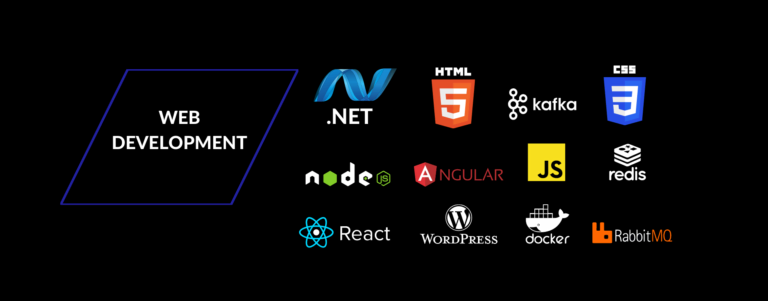

# Welcome to My GitHub Profile! 🚀

## About Me
Hello, fellow coder! 👋 I'm Kent, a passionate and seasoned Full Stack Developer with a decade of experience in shaping digital landscapes. From pixel-perfect frontends to robust server-side logic, I've been immersed in the exciting world of web development, constantly evolving and delivering high-quality solutions.

## 🔧 Skills
- **Frontend Development:** HTML, CSS, JavaScript, React, Angular, Vue
- **Backend Development:** Node.js, Python, Django, Flask
- **Database:** SQL, MongoDB, Firebase
- **Tools & Technologies:** Git, Webpack, Docker, AWS, Heroku

## 🌟 Highlights
- **Full Stack Wizard:** My expertise spans across the entire stack, ensuring end-to-end excellence in every project.
- **Code Connoisseur:** Crafting code that's not just functional but elegant. Readability is my mantra, and clean code is my art.
- **Problem Solver:** If bugs were dragons, I'd be the Khaleesi of debugging! Challenges are opportunities to find elegant solutions.

Feel free to explore my repositories for more coding adventures!

## 🎤 Fun Facts
- My favorite programming language is JavaScript/TypeScript because it is "easy".
- I believe that `console.log` is the best therapist. It listens to your problems without judgment!
- Stack Overflow is my second home. I've probably answered more questions than I've asked. #GivingBack

## 📬 Let's Connect!
If you're as passionate about coding as I am, let's connect! Feel free to reach out for collaborations, discussions, or even if you just want to share your favorite programming joke.

Happy coding! 🚀✨